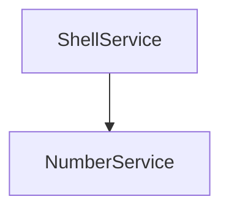

# Salt

Ultra Simple Microservices in Docker and Kubernetes 


## The project

As nano as possible
- Using super lite Linux distro images Apress
- Webservice by NC
- Scripting by bashshell script


## Structure


```shell
declare -i counter=3
function count {
    local i=${1:-5}
    echo "$i"
}
value=$(count 4)
echo "The value $value"
```

| Module    | Language | Status |
|-----------|:--------:|-------:|
|Shellweb   | bash     | OK     |
|Timesservice| bash | OK|  




## Build and run


### Build container images

How to build the nano container images to your local docker 

```shell
docker build shellweb -t shellweb
docker build timeservice -t timeservice

```

### Run container images

How to run a nano container image in docker

```shell
docker run shellweb
docker run timeservice
```


## How to run

To start the play environment and try out the differente services do the following:

### Docker compose 

```
docker compose xxx
```

